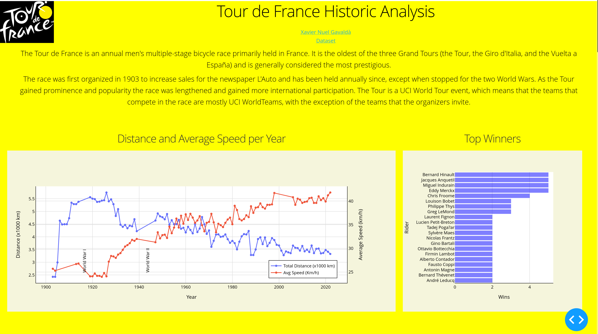
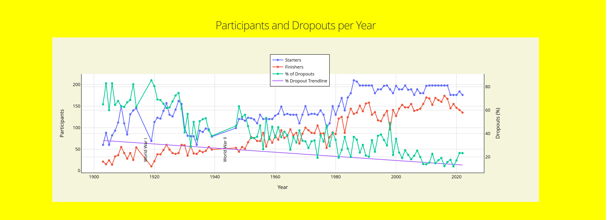
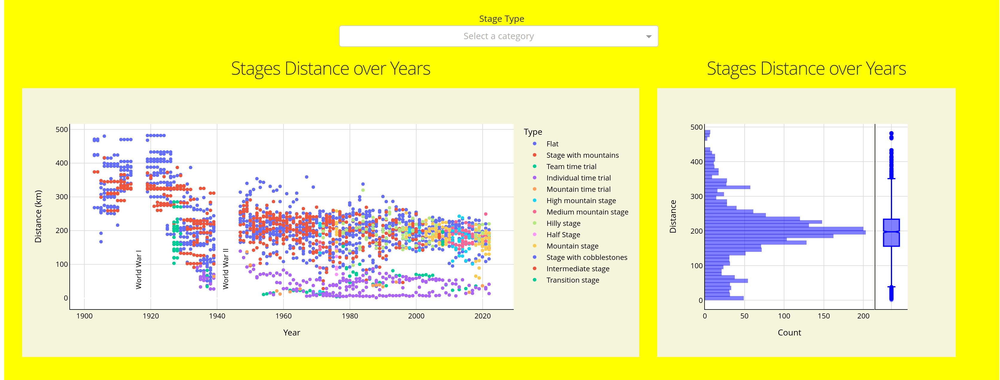
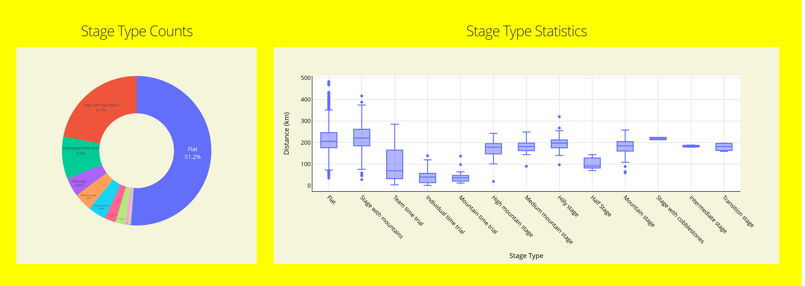
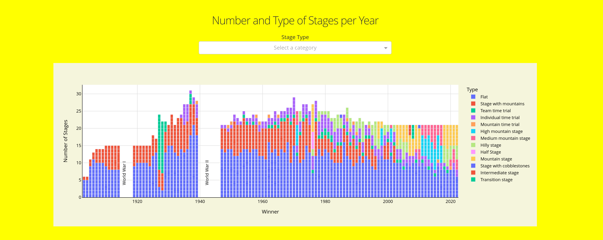
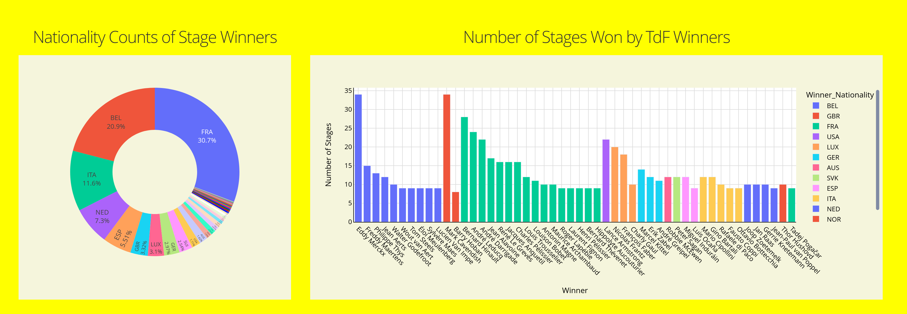
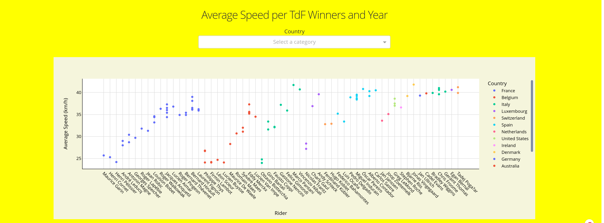
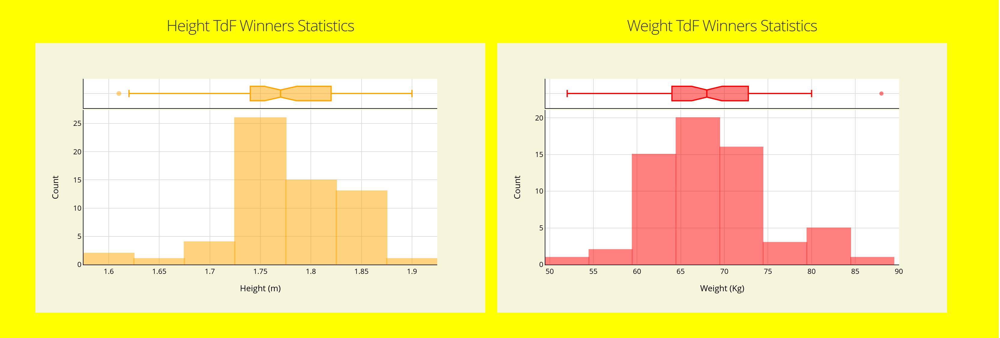
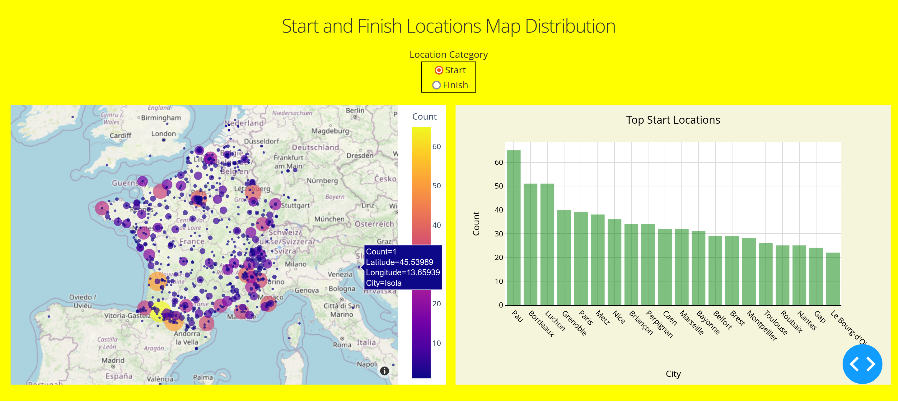

# Project: Historical Tour de France Dashboard
> The goal of this project is to learn how to implement a Dashboard using Plotly Dash.

> Dataset: https://mavenanalytics.io/challenges/maven-tour-de-france-challenge/25

## Table of Contents
* [General Info](#general-information)
* [Technologies Used](#technologies-used)
* [Setup](#setup)
* [Project Status](#project-status)
* [Room for Improvement](#room-for-improvement)
* [Contact](#contact)
<!-- * [License](#license) -->

## General Information
The goal of this project is to get insights form the historical dataset of the most prestigious cycling race on earth.

It contains the following plots, interactive dropdowns and figures:
- Scatter plot of total distance and average speed by year.
- Top winners horizontal bar chart.
- Scatter plot of participants and dropouts by year.
- Scatter plot of stage distances by year.
- Histogram of stage distance per year and horizontal histogram and box plot distribution of stage distance by year. Both figures are filtered by a stage type dropdown filter.
- Stage type counts pie chart.
- Stage type box plot.
- Bar chart of number and type of stage by year filtered by a dropwown filter over stage type.
- Nationality counts of stage winners pie chart.
- Number of stages won by Tour de France winners bar chart.
- Average speed by Tour de France winners by year scatter plot.
- Height and Weight of Tour de France winners statistics.
- Start and Finish locations map and top start and finish locations bar chart filtered by a location category dropdown filter.

## Technologies Used
- certifi==2023.7.22
- dash==2.13.0
- geopy==2.4.0
- icecream==2.1.3
- matplotlib==3.7.3
- numpy==1.24.4
- pandas==2.0.3
- plotly==5.2.1
- seaborn==0.13.0
- gunicorn
- dash-tools

## Project Status
Project is: first version finished

## Room for Improvement
This is only a quick use of the main Plotly Dash functonalities.

## Contact
Created by [Xavier Nuel Gavaldà](xaviernuelgav@gmail.com) - feel free to contact me!

<!-- Optional -->
<!-- ## License -->
<!-- This project is open source and available under the [... License](). -->

<!-- You don't have to include all sections - just the one's relevant to your project -->
